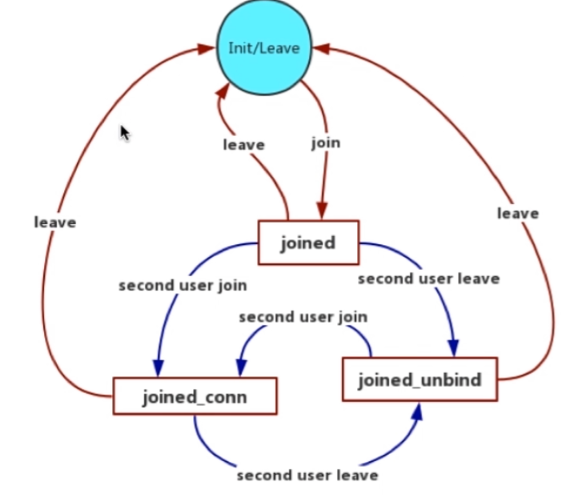
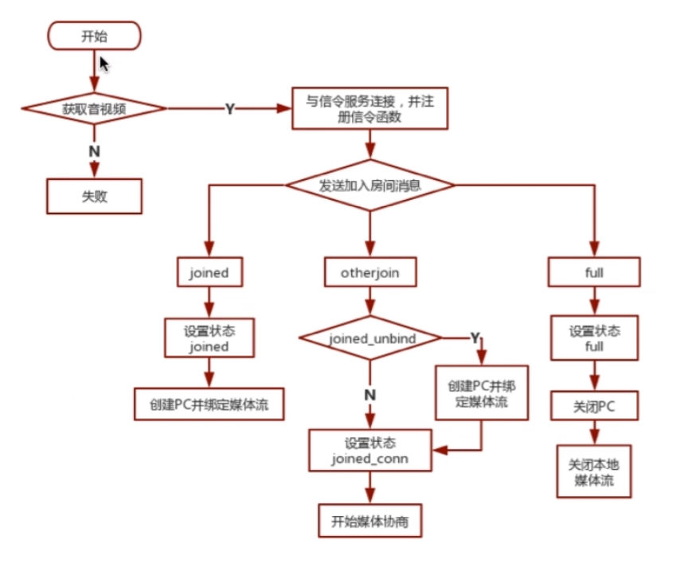
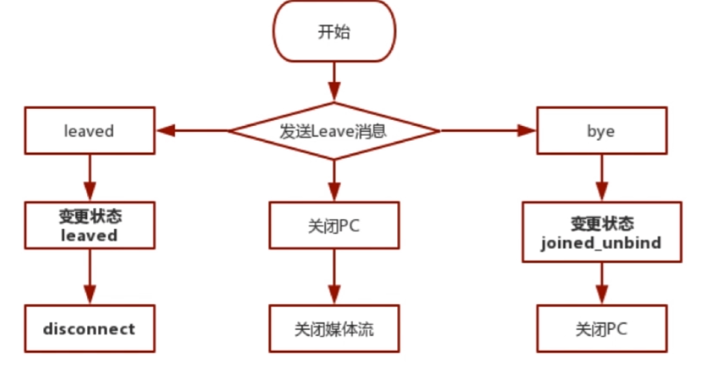
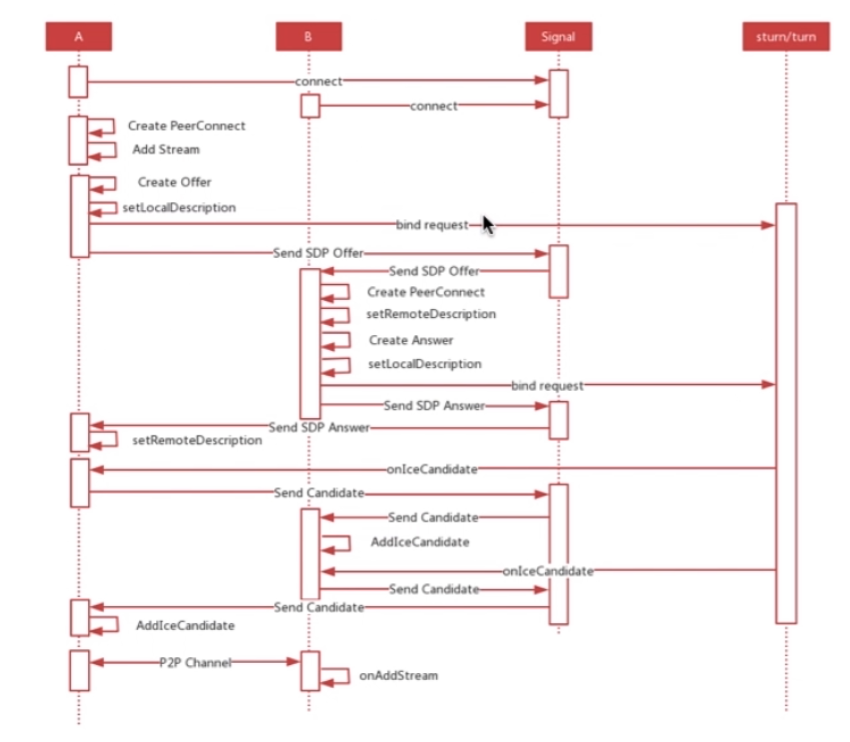

# webRTC

## MediaStream

### 方法

- MediaStream.addTrack()
- MediaStream.removeTrack()
- MediaStream.getVideoTracks()
- MediaStream.getAudioTracks()

### 事件

- MediaStream.onaddtrack
- MediaStream.onremovetrack
- MediaStream.onended

## MediaRecoder 录制媒体流

## getDisplayMedia 捕获桌面

```js
var promise = navigator.mediaDevices.getDisplayMedia(constraints);
```

浏览器输入 edge://flags/#enable-experimental-web-platform 开启实验属性

## socket.io 聊天室实现

socket.io 是 websocket 超集，底层使用的是 tcp 协议，保证消息的可靠传输

### 服务端消息处理

- socket.emit() 给本次链接发送消息
- io.in(room).emit() 给某个房间内所有人发送消息
- socket.to(room).emit() 除本链接外，给某个房间内所有人发送消息
- socket.broadcast.emit() 除本链接外，给所有人发送消息

### 客户端消息处理

发送 action 命令，还有两个数据
Server: socket.emit('action', data1, data2);
Client: socket.on('action', function(data1, data2) {});

发送了 action 命令，在 emit 方法中包含回调函数
Server: socket.emit('action', data1, function(arg1, arg2){...});
Client: socket.on('action', function(data1, fn) {fn('a','b')});

## WebRTC 信令服务器

## WebRTC 网络基础：P2P STUN TURN ICE

- NAT ( Network Address Translator )
- STUN ( Simple Traversal of UDP Through NAT )
- TURN ( Traversal Using Relays around NAT )
- ICE ( Interactive Connectivity Establishment )

### 网络协议分析

#### 常用工具

- Linux 服务端用 tcpdump
- 其他端 WireShark

## RTCPeerConnection

RTCPeerConnection 方法分类：

- 媒体协商（用的什么编解码器等等）
- Stream/Track
- 传输相关方法
- 统计相关方法

### Configuration

### 重要事件

- onnegotiationneeded 协商的时候触发
- onicecandidate 当收到一个 ice 的候选者时触发

## SDP

SDP（ Session Description Protocol ）它只是一种信息格式的描述标准，本身不属于传输协议，但是可以被其他传输协议用来交换必要的信息。

- 会话层：基本信息意义不大
- 媒体层：重要
  - 媒体格式
  - 传输协议
  - 传输 IP 和端口
  - 媒体负载类型

rtpmap fmtp

### WebRTC 中的 SDP

- SDP 组成
  - 会话元
  - 网络描述
  - 流描述
  - 安全描述
  - 服务质量

## SUTN、TURN 服务搭建

coturn 服务，github 下载

## createOffer

```js
aPromise = myPeerConnection.createOffer([options]);
```

### Options 可选

- iceRestart
- voiceActivityDetection

## 实战 真正的音视频传输

整个直播系统的核心是信令

### 客户端信令消息

- join 加入房间
- leave 离开房间
- message 端到端消息
  - Offer 消息
  - Answer 消息
  - Candidate 消息

### 服务端信令消息

- joined 已加入房间
- otherjoin 其他用户加入房间
- full 房间人数已满
- leaved 已离开房间
- bye 对方离开房间

### 直播系统消息处理流程

### 客户端状态机



### 客户端流程图




### 端对端连接的基本流程



### 直播客户端的实现

注意要点：

- 网络连接要在音视频数据获取到之后，否则有可能绑定音视频流失败
- 当一端退出房间后，另一端的 PeerConnection 要关闭重建，否则与新用户互通时媒体协商会失败。
- 异步事件处理

### 实现共享远程桌面

getDisplayMedia

```js
var promise = navigator.mediaDevices.getDisplayMedia(constraints);
```

constraints 可选：里面的约束与 getUserMedia 函数中基本一致。

注意要点：

- getDisplayMedia 无法同时采集音频
- 桌面是否可以调整分辨率
- 共享整个桌面/共享某个应用/共享某块区域
